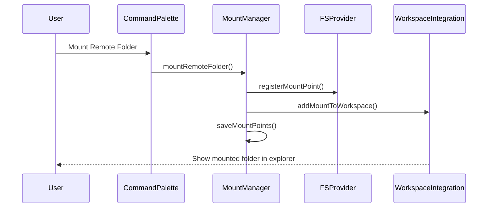

# Remote Folder Mount Feature Design

## Overview

The Remote Folder Mount feature extends the VSX Remote SSH extension by providing a seamless way to mount remote folders as if they were local in VS Code. This design leverages the existing SSH connection and file system provider infrastructure while adding new components to handle folder mounting, workspace integration, and performance optimizations.

## Architecture

### High-Level Architecture

The Remote Folder Mount feature builds on the existing VSX Remote SSH architecture:

1. **Client Side**: VS Code extension with enhanced file system provider
2. **Server Side**: Remote SSH server (unchanged)
3. **Communication**: Existing SSH tunnel for all data transfer
4. **Integration**: New workspace and explorer integration components

### Component Architecture

The feature adds several new components while enhancing existing ones:

1. **Mount Manager**: Handles the creation, tracking, and restoration of remote folder mounts
2. **Workspace Integration**: Integrates mounted folders into VS Code's workspace
3. **Enhanced File System Provider**: Extends the existing RemoteFileSystemProvider with mount-specific optimizations
4. **Mount UI**: Provides user interface for mounting, unmounting, and managing remote folders
5. **Mount State Persistence**: Saves and restores mount points across VS Code sessions

## Components and Interfaces

### 1. Mount Manager

**Purpose**: Central component for managing remote folder mounts

**Key Interfaces**:

```typescript
interface MountManager {
  mountRemoteFolder(connection: SSHConnection, remotePath: string, displayName?: string): Promise<MountPoint>
  unmountFolder(mountId: string): Promise<void>
  getMountPoints(): MountPoint[]
  getMountPointByUri(uri: vscode.Uri): MountPoint | undefined
  restoreMounts(): Promise<void>
}

interface MountPoint {
  id: string
  connectionId: string
  remotePath: string
  displayName: string
  uri: vscode.Uri
  status: 'connected' | 'disconnected' | 'error'
  lastConnected: Date
}
```

### 2. Enhanced File System Provider

**Purpose**: Extends the existing RemoteFileSystemProvider to support mounted folders

**Key Enhancements**:

```typescript
interface MountAwareFileSystemProvider extends RemoteFileSystemProvider {
  registerMountPoint(mountPoint: MountPoint): void
  unregisterMountPoint(mountId: string): void
  getMountPointForUri(uri: vscode.Uri): MountPoint | undefined
  translateMountedUriToRemoteUri(uri: vscode.Uri): vscode.Uri
}
```

### 3. Workspace Integration

**Purpose**: Integrates mounted folders into VS Code's workspace

**Key Interfaces**:

```typescript
interface WorkspaceIntegration {
  addMountToWorkspace(mountPoint: MountPoint): Promise<void>
  removeMountFromWorkspace(mountPoint: MountPoint): Promise<void>
  updateMountInWorkspace(mountPoint: MountPoint): Promise<void>
  isMountInWorkspace(mountId: string): boolean
}
```

### 4. Mount State Persistence

**Purpose**: Saves and restores mount points across VS Code sessions

**Key Interfaces**:

```typescript
interface MountStatePersistence {
  saveMountPoints(mountPoints: MountPoint[]): Promise<void>
  loadMountPoints(): Promise<MountPoint[]>
  clearMountPoints(): Promise<void>
}
```

## Data Models

### Mount Point Model

```typescript
interface MountPoint {
  id: string                 // Unique identifier for the mount
  connectionId: string       // ID of the SSH connection
  remotePath: string         // Path on the remote server
  displayName: string        // Display name in the explorer
  uri: vscode.Uri           // URI for accessing the mount
  status: MountStatus       // Current status of the mount
  lastConnected: Date       // Last successful connection time
  options: MountOptions     // Mount-specific options
}

enum MountStatus {
  Connected = 'connected',
  Disconnected = 'disconnected',
  Connecting = 'connecting',
  Error = 'error'
}

interface MountOptions {
  autoReconnect: boolean     // Whether to automatically reconnect
  cacheEnabled: boolean      // Whether caching is enabled
  watchEnabled: boolean      // Whether file watching is enabled
  watchExcludePatterns: string[] // Patterns to exclude from watching
}
```

### Mount URI Scheme

The feature will use a custom URI scheme for mounted folders:

```
ssh-mount://{mountId}/{path}
```

This scheme allows the system to:
1. Identify URIs that refer to mounted folders
2. Quickly look up the corresponding mount point
3. Translate between mounted URIs and remote SSH URIs

## Implementation Details

### Mount Creation Flow

1. User initiates mount via command palette or context menu
2. System prompts for SSH connection (or uses active connection)
3. System prompts for remote folder path
4. System creates mount point and registers with file system provider
5. System adds mount to workspace
6. System saves mount state for persistence



### URI Translation

A key aspect of the implementation is translating between different URI schemes:

1. **Mounted URI**: `ssh-mount://{mountId}/path/to/file`
2. **Remote URI**: `ssh://{connectionId}/path/to/remote/folder/path/to/file`

The translation process:

```typescript
function translateMountedUriToRemoteUri(uri: vscode.Uri): vscode.Uri {
  // Extract mount ID from authority
  const mountId = uri.authority;
  
  // Look up mount point
  const mountPoint = getMountPointById(mountId);
  if (!mountPoint) {
    throw new Error(`Mount point not found: ${mountId}`);
  }
  
  // Combine remote path with relative path from mount
  const relativePath = uri.path;
  const remotePath = path.posix.join(mountPoint.remotePath, relativePath);
  
  // Create remote URI
  return vscode.Uri.parse(`ssh://${mountPoint.connectionId}${remotePath}`);
}
```

### File System Operations

All file system operations will be delegated to the existing RemoteFileSystemProvider after URI translation:

```typescript
class MountAwareFileSystemProviderImpl implements MountAwareFileSystemProvider {
  private remoteProvider: RemoteFileSystemProvider;
  private mountPoints: Map<string, MountPoint> = new Map();
  
  constructor(remoteProvider: RemoteFileSystemProvider) {
    this.remoteProvider = remoteProvider;
  }
  
  async readFile(uri: vscode.Uri): Promise<Uint8Array> {
    const remoteUri = this.translateMountedUriToRemoteUri(uri);
    return this.remoteProvider.readFile(remoteUri);
  }
  
  // Similar implementations for other file system operations
}
```

### Workspace Integration

The feature will integrate with VS Code's workspace API to add mounted folders:

```typescript
class WorkspaceIntegrationImpl implements WorkspaceIntegration {
  async addMountToWorkspace(mountPoint: MountPoint): Promise<void> {
    // Create workspace folder from mount point
    const workspaceFolder: vscode.WorkspaceFolder = {
      uri: mountPoint.uri,
      name: mountPoint.displayName,
      index: vscode.workspace.workspaceFolders?.length ?? 0
    };
    
    // Add to workspace
    if (vscode.workspace.workspaceFolders) {
      vscode.workspace.updateWorkspaceFolders(
        vscode.workspace.workspaceFolders.length,
        0,
        { uri: mountPoint.uri, name: mountPoint.displayName }
      );
    } else {
      vscode.workspace.updateWorkspaceFolders(0, 0, 
        { uri: mountPoint.uri, name: mountPoint.displayName }
      );
    }
  }
}
```

### Mount State Persistence

The feature will save mount points to VS Code's global storage:

```typescript
class MountStatePersistenceImpl implements MountStatePersistence {
  private context: vscode.ExtensionContext;
  
  constructor(context: vscode.ExtensionContext) {
    this.context = context;
  }
  
  async saveMountPoints(mountPoints: MountPoint[]): Promise<void> {
    // Convert mount points to serializable format
    const serialized = mountPoints.map(mp => ({
      id: mp.id,
      connectionId: mp.connectionId,
      remotePath: mp.remotePath,
      displayName: mp.displayName,
      options: mp.options
    }));
    
    // Save to global state
    await this.context.globalState.update('remoteFolderMounts', serialized);
  }
  
  async loadMountPoints(): Promise<MountPoint[]> {
    // Load from global state
    const serialized = this.context.globalState.get<any[]>('remoteFolderMounts') || [];
    
    // Convert to mount points
    return serialized.map(s => ({
      id: s.id,
      connectionId: s.connectionId,
      remotePath: s.remotePath,
      displayName: s.displayName,
      uri: vscode.Uri.parse(`ssh-mount://${s.id}/`),
      status: 'disconnected',
      lastConnected: new Date(0),
      options: s.options
    }));
  }
}
```

## Performance Optimizations

### Caching Strategy

The feature will enhance the existing caching mechanism:

1. **Directory Listing Cache**: Cache directory listings for faster navigation
2. **File Content Cache**: Cache recently accessed files for faster reopening
3. **Metadata Cache**: Cache file metadata to reduce network requests
4. **Hierarchical Invalidation**: Intelligently invalidate cache entries when changes occur

### File Watching Optimizations

To minimize network traffic while keeping the UI updated:

1. **Selective Watching**: Only watch directories that are expanded in the explorer
2. **Polling Reduction**: Use server-side events when possible
3. **Batch Updates**: Combine multiple file change notifications
4. **Exclude Patterns**: Allow users to exclude paths from watching

### Connection Management

To handle network issues gracefully:

1. **Automatic Reconnection**: Attempt to reconnect when connection is lost
2. **Connection Pooling**: Reuse SSH connections across multiple mount points
3. **Operation Queueing**: Queue operations during disconnection for later execution
4. **Visual Indicators**: Show connection status in the UI

## User Interface

### Command Palette Integration

New commands will be added to the command palette:

1. `remote-ssh.mountFolder`: Mount a remote folder
2. `remote-ssh.unmountFolder`: Unmount a remote folder
3. `remote-ssh.manageMounts`: Manage mounted folders
4. `remote-ssh.refreshMount`: Refresh a mounted folder

### Context Menu Integration

Context menu items will be added to:

1. SSH connections in the Remote Explorer view
2. Mounted folders in the Explorer view

### Status Bar Integration

A status bar item will show:

1. Number of active mounts
2. Connection status of mounts
3. Quick access to mount management

## Error Handling

### Mount Errors

- **Connection Failures**: Show error with reconnection options
- **Permission Issues**: Provide clear guidance on fixing permissions
- **Path Not Found**: Suggest creating the directory or checking the path
- **Workspace Conflicts**: Handle name conflicts in the workspace

### Recovery Strategies

- **Automatic Reconnection**: Attempt to reconnect lost mounts
- **Manual Refresh**: Allow users to manually refresh mounts
- **Mount Repair**: Provide options to fix broken mounts
- **Clear Cache**: Allow users to clear the cache for a mount

## Testing Strategy

### Unit Testing

- **Mount Manager**: Test mount creation, tracking, and restoration
- **URI Translation**: Test conversion between URI schemes
- **Workspace Integration**: Test adding and removing mounts from workspace
- **State Persistence**: Test saving and loading mount points

### Integration Testing

- **End-to-End Workflows**: Test complete mount and unmount flows
- **File Operations**: Test file operations on mounted folders
- **Connection Handling**: Test behavior during connection loss and recovery
- **Performance**: Test caching and optimization strategies

### User Experience Testing

- **Explorer Integration**: Verify mounted folders appear correctly in explorer
- **Command Accessibility**: Ensure commands are discoverable and work as expected
- **Error Handling**: Verify error messages are clear and helpful
- **Performance Perception**: Ensure the UI remains responsive during operations

## Conclusion

The Remote Folder Mount feature will significantly enhance the VSX Remote SSH extension by providing a seamless way to work with remote files through VS Code's standard interfaces. By leveraging the existing SSH connection and file system infrastructure while adding new components for mounting and workspace integration, the feature will deliver a native-like experience for remote development.